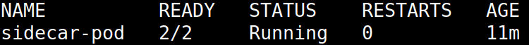
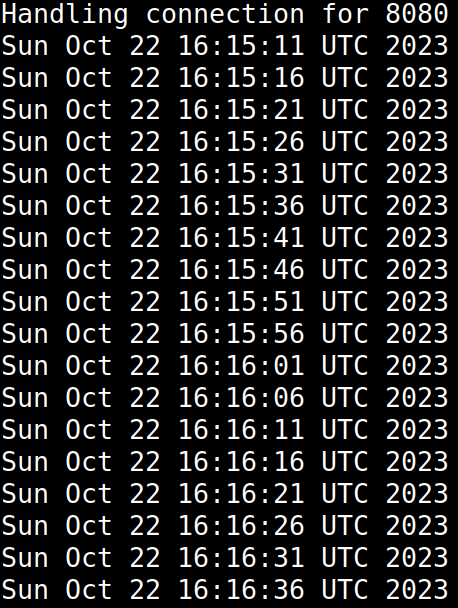

# Sidecar Pod
Simple Kubernetes pod with a sidecar container.

## Description
The containers included in this pod are:
- `busybox` - saves the current date to a log file every 5 seconds.
- `nginx` - exposes the log file.

The logs are saved in a volume with host path `/mnt/logs`.

## Running the pod

### Creating a namespace for the pod
If the namespace `lab3` does not already exist, it needs to be created with:
```
kubectl create namespace lab3
```

### Creating the pod
After the namespace is present, the pod should be created with:
```
kubectl create -f sidecar-pod.yml
```

The following command checks the pods in the `lab3` namespace:
```
kubectl -n lab3 get pod
```



## Checking the results
To check if the logs are correctly saved and exposed by nginx, run the following commands:
```
kubectl port-forward -n lab3 sidecar-pod 8080:80 &
curl localhost:8080/date.log
fg
[Ctrl+C]
```

Example logs that have been saved:


